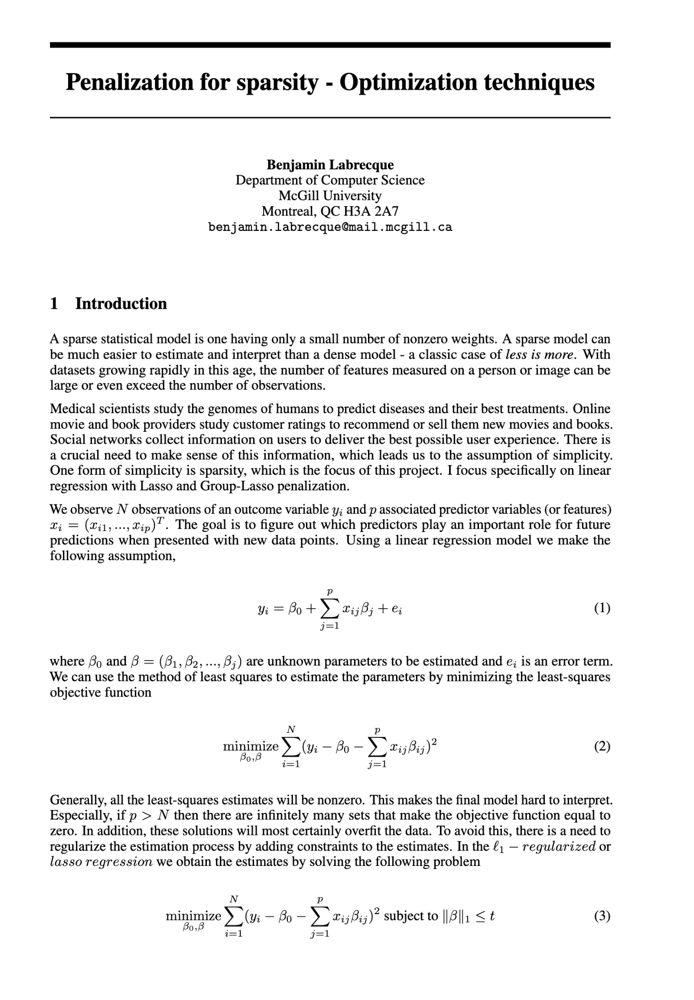

# Penalization for sparsity — optimization techniques

In this project I investigated various optimization techniques for penalization of sparse datasets.

## Report

You can find the full PDF report [here](COMP_400_Project.pdf).

## Preview

## Resources

The main 2 resources consulted for this project were:

1. Statistical Learning with Sparsity: The Lasso and Generalizations by Martin J. Wainwright, Robert Tibshirani, and Trevor Hastie
2. Convex Optimization course instructed by Ryan Tibshirani at CMU: https://www.stat.cmu.edu/~ryantibs/convexopt/
